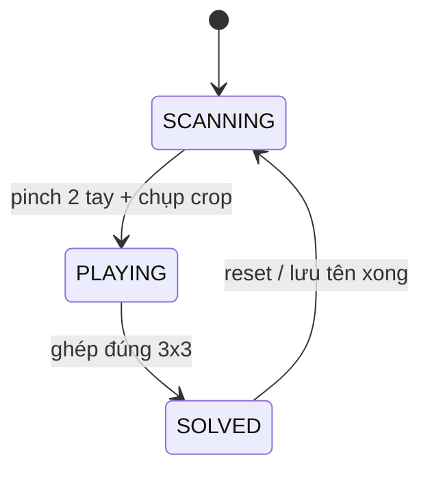

# Live Puzzle — Gameplay Export

Thư mục này tách **toàn bộ logic chơi** (puzzle, cử chỉ, chụp ảnh, kéo thả) khỏi React/Next.js để bạn gắn vào **UI bất kỳ** (Vue, Svelte, native WebView, game engine canvas, v.v.).

## Phụ thuộc

```bash
npm install @mediapipe/tasks-vision@^0.10.14
```

Chỉ chạy trên **trình duyệt** (cần `canvas`, `getUserMedia`, WASM MediaPipe).

## Cấu trúc file

| File | Vai trò |
|------|---------|
| `PuzzlePlayerSession.ts` | **Trái tim** — state + `tickScan` / `tickPlay` cho 1 người |
| `puzzle.ts` | Ô puzzle, thắng, crop ảnh, vẽ lưới |
| `gestures.ts` | Pinch, khung hai tay, smoothing con trỏ |
| `coordinates.ts` | Mirror X, solo full / duo panel |
| `hand-tracking.ts` | MediaPipe, camera, skeleton |
| `canvas-draw.ts` | Helper vẽ (tùy chọn — UI có thể tự vẽ) |
| `constants.ts` | Ngưỡng pinch, 3×3, màu P1/P2 |
| `types.ts` | Kiểu dùng chung |

## Vòng đời gameplay (một người)



1. **SCANNING** — Đúng 2 tay: ngón giơ tạo khung → lưu `lastFrameBounds`. Hai tay cùng **nắm** (pinch) → chụp vùng khung từ video → `puzzleImage` + `tiles` xáo trộn → `PLAYING`.
2. **PLAYING** — Một tay (primary): nắm nhấc ô, thả đổi chỗ ô đang hover. Thắng → `SOLVED`.
3. **SOLVED** — UI của bạn hiện overlay; gọi `session.finishSolved()` hoặc `session.reset()` khi chơi lại.

## Solo — vòng lặp tối thiểu

```ts
import {
  createSoloSession,
  createHandLandmarker,
  startUserCamera,
  pickPrimaryHand,
  drawMirroredVideo,
  drawScanOverlay,
  drawPlayLayer,
  drawHandsOverlay,
  PLAYER_COLORS
} from './gameplay'; // đường dẫn sau khi copy

const video = document.querySelector('video')!;
const canvas = document.querySelector('canvas')!;
const ctx = canvas.getContext('2d')!;
const session = createSoloSession();
const landmarker = await createHandLandmarker();
await startUserCamera(video);

function loop() {
  const W = (canvas.width = video.videoWidth);
  const H = (canvas.height = video.videoHeight);
  const t = performance.now();
  const results = landmarker.detectForVideo(video, t);

  ctx.clearRect(0, 0, W, H);
  drawMirroredVideo(ctx, video, W, H);

  if (session.phase === 'SCANNING') {
    const scan = session.tickScan(results.landmarks, video, W, H);
    drawScanOverlay(ctx, scan);
    if (scan.justCaptured) onStartPlaying(); // timer UI, v.v.
  } else {
    const hand = pickPrimaryHand(results.landmarks);
    const play = session.tickPlay(hand, W, H);
    if (play) {
      drawPlayLayer(ctx, session, play, PLAYER_COLORS.p1);
      if (play.justSolved) onSolved();
    }
  }

  drawHandsOverlay(ctx, results.landmarks, session.layout, W, H, PLAYER_COLORS.p1, session.phase);
  requestAnimationFrame(loop);
}
requestAnimationFrame(loop);
```

## Duo — khác biệt so với Solo

| | Solo | Duo (mỗi người) |
|---|------|------------------|
| Layout | `{ mode: 'full' }` | `{ mode: 'panel', offsetX: 0 \| W/2, panelW: W/2 }` |
| Detect tay | 1× `detectForVideo(video)` | 2× landmarker trên **crop nửa video** (`prepareDuoCropBuffers`) |
| Session | 1× `createSoloSession()` | 2× `createDuoPanelSession(0, hw)` + `createDuoPanelSession(hw, hw)` |
| Phase | Một `phase` chung | `p1.phase`, `p2.phase` độc lập |

Pseudo duo (rút gọn):

```ts
const hw = W / 2;
const p1 = createDuoPanelSession(0, hw);
const p2 = createDuoPanelSession(hw, hw);
const { left, right } = await createDuoHandLandmarkers();
const crops = prepareDuoCropBuffers(video, hw, H); // tái tạo mỗi frame hoặc giữ ref

// mỗi frame:
left.getContext('2d')!.drawImage(/* cập nhật crop trái */);
const resL = lmLeft.detectForVideo(crops.left, t);
const resR = lmRight.detectForVideo(crops.right, t);

drawDuoDivider(ctx, W, H);
if (p1.phase === 'SCANNING') p1.tickScan(resL.landmarks, video, W, H);
// landmarks duo panel: tọa độ normalized trên **crop nửa**, session vẫn map đúng nhờ offsetX/panelW
```

Chi tiết crop video khớp `GestureCameraDuo.tsx` — xem `hand-tracking.ts` → `prepareDuoCropBuffers`.

## API `PuzzlePlayerSession` (tóm tắt)

```ts
class PuzzlePlayerSession {
  phase: 'SCANNING' | 'PLAYING' | 'SOLVED';
  tiles: Tile[];
  puzzleImage: HTMLCanvasElement | null;
  layout: ViewLayout;

  reset(): void;
  finishSolved(): void; // → SCANNING

  tickScan(landmarks, video, canvasW, canvasH, now?): ScanTickResult;
  tickPlay(hand, canvasW, canvasH): PlayTickResult | null;
  getBoardRect(canvasW, canvasH): BoardRect | null;
}
```

### `ScanTickResult`

- `scanRect` — vẽ khung vàng
- `justCaptured` — bắt đầu timer / ẩn hướng dẫn scan
- `metrics.framing` / `metrics.pinching` — debug HUD

### `PlayTickResult`

- `boardRect`, `hoverIndex`, `cursor`, `drag` — vẽ puzzle + con trỏ
- `justSolved` — hiện overlay thắng

## UI của bạn cần tự làm

- Menu chọn solo/duo, nút back
- Overlay loading camera / AI
- Timer (`setInterval` khi `phase === 'PLAYING'`)
- Overlay SOLVED + `localStorage` tên (không nằm trong gameplay export)
- Styling — dùng file `export/live-puzzle-ui.html` làm reference

## Đồng bộ với repo gốc

Logic được trích từ:

- `app/lib/puzzle-shared.ts`
- `app/components/GestureCameraSolo.tsx`
- `app/components/GestureCameraDuo.tsx`

Khi sửa gameplay trong app Next.js, nên cập nhật song song `export/gameplay` (hoặc import trực tiếp từ đây nếu refactor `app/lib` → re-export).

## Copy sang project khác

1. Copy cả thư mục `export/gameplay`.
2. Cấu hình TypeScript / bundler resolve `.ts`.
3. Cài `@mediapipe/tasks-vision`.
4. Trong UI: `<video>` ẩn + `<canvas>` full (hoặc WebGL texture từ cùng `puzzleImage`).
5. Đọc `INTEGRATION.md` + chạy thử vòng `loop` ở trên.

## Constants có thể tinh chỉnh

- `PINCH_THRESHOLD` / `PINCH_RELEASE_THRESHOLD` — độ nhạy nắm
- `FRAME_THRESHOLD` — hai ngón “giơ” tạo khung
- `CAPTURE_COOLDOWN_MS` — tránh chụp liên tiếp
- `COLS` / `ROWS` — hiện cố định 3×3
